# Official implementation of DTP(AAAI'22)

This is the official implementation of our paper :

**Deep Translation Prior: Test-time Training for Photorealistic Style Transfer(AAAI 2022)**

Authors: Sunwoo Kim, Soohyun Kim and [Seungryong Kim](https://seungryong.github.io/)

You can check out the paper on [[arXiv](https://arxiv.org/abs/2112.06150)].

# Network

Our model DTP is illustrated below:


## Example Results
<p align="center">
 
 </p>
<!-- <p align="center">
     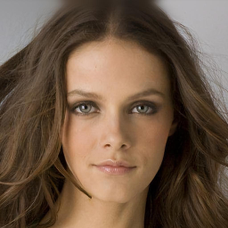 
</p>
<p align="center">
 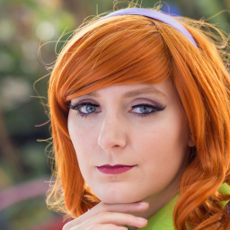   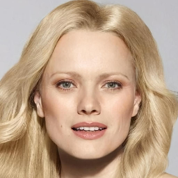 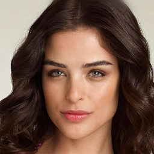
</p>
<p align="center">
   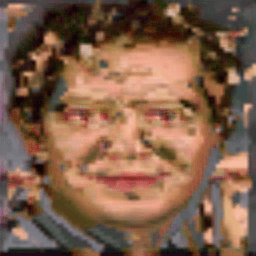  
</p>


<p align="center">
 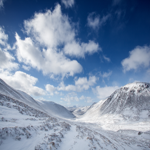 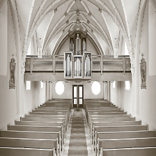  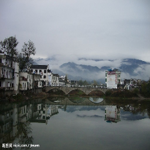 
</p>
<p align="center">
    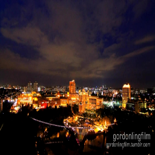 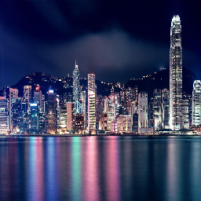
</p>
<p align="center">   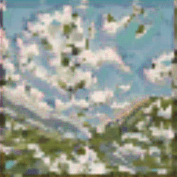  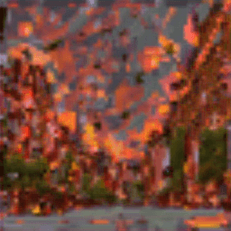 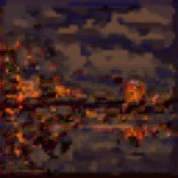 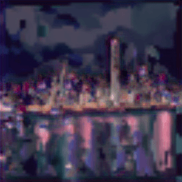
</p> -->


## Getting started
- Clone this repo
```
git clone https://github.com/sunwoo76/Deep_Translation_Prior
cd Deep_Translation_Prior
```

- Start optimizing
```
bash optimizer.sh
```

## Acknowledgement
We borrow codes and datasets from public projects. We mainly borrow code from  [CUT](https://github.com/taesungp/contrastive-unpaired-translation)

You can download the datasets used in this paper from the github repositories of [WCT2](https://github.com/clovaai/WCT2), [StyleNas](https://github.com/pkuanjie/StyleNAS),  [FFHQ](https://github.com/NVlabs/ffhq-dataset) and [CelebA-HQ](https://github.com/tkarras/progressive_growing_of_gans)

## Citation
If you find this research useful, please consider citing:
````BibTeX
@article{kim2021deep,
  title={Deep Translation Prior: Test-time Training for Photorealistic Style Transfer},
  author={Kim, Sunwoo and Kim, Soohyun and Kim, Seungryong},
  journal={arXiv preprint arXiv:2112.06150},
  year={2021}
}
````


